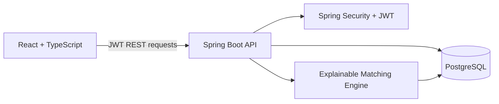

# CampusOS Nexus Architecture

CampusOS Nexus is a React single-page application backed by a Spring Boot REST API and PostgreSQL.

## Core flow

1. A student creates a capability profile with demonstrated skills, evidence, interests, and availability.
2. A project owner posts a project and identifies required skills, duration, and status.
3. The matching engine ranks candidates using weighted, explainable signals.
4. Teams use gap analysis to identify uncovered required skills.
5. Applications, team membership, reviews, and verified contributions become portfolio proof.

## Matching version 1

| Signal | Weight | Current evidence |
|---|---:|---|
| Skill similarity | 40% | Required skills matched |
| Relevant experience | 25% | Evidence attached to matching skills |
| Interest alignment | 20% | Profile interests vs. project domain |
| Availability | 10% | Availability supplied on profile |
| Collaboration history | 5% | Average peer-review rating |

The API returns the score components and the reasons, so users can understand each recommendation.
